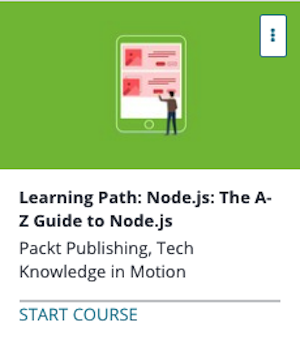

```
Roberto Nogueira  
BSd EE, MSd CE
Solution Integrator Experienced - Certified by Ericsson
```
# Udemy Learning Path: Node.js



**About **

Learn everything you need to about the subject of this `Udemy` project.

[Homepage](https://www.udemy.com/learning-path-nodejs-the-a-z-guide-to-nodejs/learn/v4/content)

## Topics
```
Section: 1
0 / 25
Server-side Programming with Node.js for Beginners
[x] 1. The Course Overview 1:43
[x] 2. Node.js Overview 4:30
[x] 3. Overview of Command Line and Version Control 18:28
[x] 4. Installation and Setup of Node.js 2:43
[x] 5. JavaScript Syntax 11:35
[ ] 6. Introduction to NPM 4:57
[ ] 7. Building Your First Server with Node.js 6:12
[ ] 8. Modules 8:03
[ ] 9. Routing in Node.js 3:43
[ ] 10. Building a Small Web App Using GET and POST Requests 14:46
[ ] 11. The HTTP Module 5:16
[ ] 12. Reading Data from Files 8:10
[ ] 13. Writing and Updating Files 6:14
[ ] 14. Renaming and Removing Files 3:56
[ ] 15. Using MVC to Structure Our Application 5:52
[ ] 16. Using ExpressJS to Serve Static Files and Set Our View Engine 8:03
[ ] 17. Routing in ExpressJS 4:29
[ ] 18. Introduction to the MongoDB API and JSON Databases 7:10
[ ] 19. Inserting and Requesting Data 6:57
[ ] 20. Updating and Deleting Data in MongoDB 3:53
[ ] 21. RESTful Routes for Our Backend 6:40
[ ] 22. Create and Read Functionality 7:42
[ ] 23. Update and Delete Functionality 10:41
[ ] 24. Deploying Our Application to Heroku 6:54
[ ] Quiz 1: Server-side Programming with Node.js for Beginners

Section: 2
0 / 28
RESTful Web API Design with Node.js - Second Edition
[ ] 25. The Course Overview 2:25
[ ] 26. What Is an API? 2:24
[ ] 27. Communication via HTTP 6:50
[ ] 28. Identifying REST Resources 4:28
[ ] 29. Properties of RESTful APIs 6:51
[ ] 30. Setting Up the Environment 7:08
[ ] 31. A Look at OAuth 1.0a 5:45
[ ] 32. Sample Application Code Architecture 4:57
[ ] 33. Creating an OAuth Login Request 6:09
[ ] 34. Getting an Access Token 3:28
[ ] 35. Exploring Twitter’s REST API 7:01
[ ] 36. Accessing Cursored Collections with Async.js 8:08
[ ] 37. Choosing a Database 5:00
[ ] 38. Saving Data in MongoDB 7:48
[ ] 39. Designing the API Specifications 3:35
[ ] 40. Creating the API Handlers 7:16
[ ] 41. Acceptance Testing with Postman 11:31
[ ] 42. Load Testing and Going Multicore 7:30
[ ] 43. Testing User-Perceived Performance 7:52
[ ] 44. Facebook Graph API 7:08
[ ] 45. GitHub API 5:08
[ ] 46. IFTTT 3:05
[ ] 47. Security Considerations 3:45
[ ] 48. Documentation 4:32
[ ] 49. Versioning 2:08
[ ] 50. Caching 4:13
[ ] 51. Reliability 11:33
[ ] Quiz 2: RESTful Web API Design with Node.js - Second Edition

Section: 3
0 / 37
Mastering Node.js
[ ] 52. The Course Overview 7:04
[ ] 53. Installation and Setup 4:37
[ ] 54. Node.js Under the Hood 8:29
[ ] 55. Read Eval Print Loop 6:12
[ ] 56. Event Loop 5:02
[ ] 57. CLI Interactions 6:21
[ ] 58. Commander.js and prompt 8:22
[ ] 59. Make Your Tool Global 5:31
[ ] 60. Understanding Events 5:36
[ ] 61. Timers 7:21
[ ] 62. Creating an Event 8:38
[ ] 63. Events in Depth 6:50
[ ] 64. Exploring Streams 6:00
[ ] 65. Object Streams 5:39
[ ] 66. Creating an http-server 7:47
[ ] 67. Handling Post Data 6:01
[ ] 68. Express.js 9:00
[ ] 69. Request Middleware 8:33
[ ] 70. Social Logins 10:34
[ ] 71. Koa.js 9:48
[ ] 72. Iterating Over Files and Folders 7:16
[ ] 73. Reading a File 9:07
[ ] 74. Writing a File 9:55
[ ] 75. Handling File Uploads 9:24
[ ] 76. Taking Control Over the Process 6:25
[ ] 77. Creating Child Processes 12:06
[ ] 78. Communicating with Your Child Processes 7:36
[ ] 79. Using Bi-Directional Communication with Socket.IO 12:56
[ ] 80. Server-Sent Events 10:26
[ ] 81. Server to Server Communication 6:12
[ ] 82. Why Scale? 5:26
[ ] 83. Microservices That Scale 12:31
[ ] 84. Bringing an Application to the Cloud 8:58
[ ] 85. Testing and spying 13:38
[ ] 86. Testing an API 7:45
[ ] 87. References 11:40
[ ] Quiz 3: Mastering Node.js

Section: 4
0 / 42
Node.js Projects
[x] 88. Installing Node.js and Express Generator 3:02
[x] 89. Building the Baseline 4:47
[ ] 90. Changing the Application's Structure 4:01
[ ] 91. Restructuring the Views Folder Using Partials 3:10
[ ] 92. Adding Templates for Login, Sign-Up, and Profile 2:12
[ ] 93. Refactoring the app.js File with the New Middleware 2:11
[ ] 94. Adding Config and Passport Files 0:48
[ ] 95. Creating Models Folder, Adding a User Schema, and Protecting Routes 1:50
[ ] 96. Creating the Controllers Folder 1:55
[ ] 97. Running the Application and Adding Comments 1:57
[ ] 98. Baseline Application and Swig Template Engine 3:21
[ ] 99. Refactoring the Views Folder and Creating a Controllers Folder 3:06
[ ] 100. Adding Partials Files and Dealing with Sequelize-CLI 3:03
[ ] 101. Editing the config.js File with Database Credentials 0:56
[ ] 102. Creating User Scheme and Band Schema 2:22
[ ] 103. Creating the Database on MySQL and Checking Database Tables 3:29
[ ] 104. Creating Application Controllers, Templates, and Views 1:50
[ ] 105. Adding Style, Routes, and a Controller to the Application 2:04
[ ] 106. Adding Database Content and Creating Bands Form 3:00
[ ] 107. Creating and Editing Models with Command Line 4:23
[ ] 108. Creating a Data Source and Connecting Models to It 2:21
[ ] 109. Using the API Explorer 3:12
[ ] 110. Adding Database Relations 1:25
[ ] 111. Dealing with LoopBack Boot Files 1:42
[ ] 112. Consuming the API 2:25
[ ] 113. Creating React Components 3:40
[ ] 114. Creating New Feedbacks 2:48
[ ] 115. Creating the Baseline Application 7:58
[ ] 116. Refactoring the Application Folder 5:50
[ ] 117. Refactoring the Client Folder 2:23
[ ] 118. Creating the AngularJS Application 2:45
[ ] 119. Adding Content to the Application 1:11
[ ] 120. Creating the Building Tasks and Using It with Individual Commands 5:44
[ ] 121. Deploying to Heroku Cloud 4:29
[ ] 122. Baseline Application 6:17
[ ] 123. Baseline Application (Continued) 9:14
[ ] 124. Creating a GitHub and Heroku Free Account 2:22
[ ] 125. Creating a MongoLab Free Sandbox Account 2:12
[ ] 126. Initializing a Git Repository and Pushing to GitHub 1:50
[ ] 127. Creating a Heroku Application Using Heroku Dashboard 2:23
[ ] 128. Creating a Codeship Free Account 6:56
[ ] Quiz 4: Node.js Projects
```
